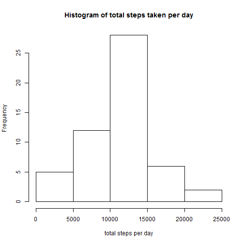
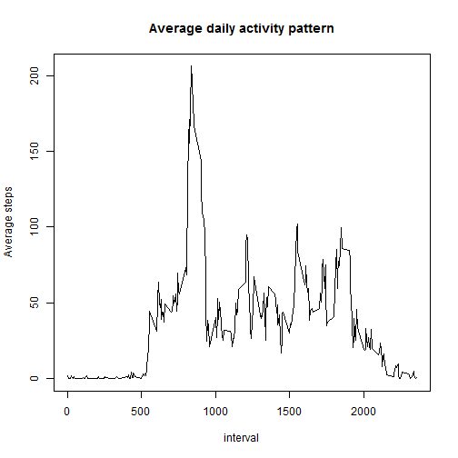
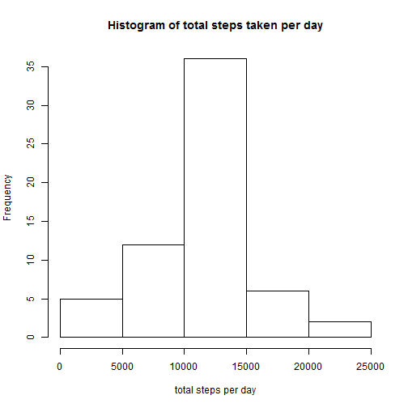

Reproducible Research: Peer Assessment 1
===================================

## Loading and preprocessing the data
Using read.csv to read in the data. And it's better to transfer date into Date format for future analysis.

```r
rawData <- read.csv("E:/R/5.Reproducible/Project/activity.csv", stringsAsFactors = F)
rawData <- transform(rawData, date = as.Date(date))
```
Now we can start playing with this dataset.


## What is mean total number of steps taken per day?
* First calculate the total number steps of a given day, by adding up the steps in each interval

```r
library(plyr)
dailyData <- ddply(rawData, ~ date, summarise, dailySteps=sum(steps))
```

* Make a histogram of the total number of steps taken each day

```r
hist(dailyData$dailySteps, main = "Histogram of total steps taken per day", xlab = "total steps per day")
```

 

* Calculate and report the mean and median of the total number of steps taken per day

```r
mean(dailyData$dailySteps, na.rm = T)
```

```
## [1] 10766.19
```

```r
median(dailyData$dailySteps, na.rm = T)
```

```
## [1] 10765
```

## What is the average daily activity pattern?
* Let's first aggeregate average steps of each interval across the logged days.

```r
intervalData <- ddply(rawData, ~interval, summarise, avgSteps=mean(steps, na.rm = T))
```

* Make a time series plot of the 5-minute interval and the average number of steps taken, averaged across all days

```r
with(intervalData, plot(interval, avgSteps, type = "l", main = "Average daily activity pattern", ylab = "Average steps"))
```

 

* Which 5-minute interval, on average across all the days in the dataset, contains the maximum number of steps?

```r
intervalData$interval[which.max(intervalData$avgSteps)]
```

```
## [1] 835
```

## Imputing missing values
* Caculate and report the total number of missing values in the dataset

```r
sum(is.na(rawData$steps))
```

```
## [1] 2304
```

* Strategy for filling in all of the missing values: use the mean for that 5-minute interval.

```r
impute.mean <- function(x) replace(x, is.na(x), mean(x, na.rm = TRUE))
```

* Create a new dataset that is equal to the original dataset but with the missing data filled in.

```r
data <- ddply(rawData, ~ interval, transform, steps = impute.mean(steps))
```

* Make a histogram of the total number of steps taken each day and Calculate and report the mean and median total number of steps taken per day. What is the impact of imputing missing data on the estimates of the total daily number of steps?

```r
dailyData2 <- ddply(data, ~ date, summarise, dailySteps=sum(steps))
hist(dailyData2$dailySteps, main = "Histogram of total steps taken per day", xlab = "total steps per day")
```

 

```r
mean(dailyData2$dailySteps, na.rm = T)
```

```
## [1] 10766.19
```

```r
median(dailyData2$dailySteps, na.rm = T)
```

```
## [1] 10766.19
```
We can see the mean didn't change, as the inserted values are the daily average. However the median shifted a bit, as we are scattering the missing values on either side of the center of distribution.

## Are there differences in activity patterns between weekdays and weekends?
* Create a new factor variable indicating whether a given date is a weekday or weekend day.

```r
data$weekdays <- as.factor(ifelse(weekdays(data$date) %in% c("Saturday","Sunday"), "Weekend", "Weekday"))
```

* Make a panel plot containing a time series plot of the 5-minute interval and the average number of steps taken, averaged across all weekday days or weekend days.

```r
weekdayData <- ddply(data, ~ weekdays+interval, summarise, weekdaySteps=mean(steps))
library(lattice)
xyplot(weekdaySteps ~ interval | weekdays, type = "l", xlab = "Interval", ylab= "Number of steps", layout = c(1,2), data = weekdayData)
```

 
